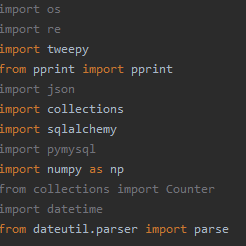

## **Capstone Project**

This is the Capstone Project for the CodingNomads Python Course.

In this project I had to collect data from a bunch of tweets using Tweepy python Library, in order to get:

- The average number of followers.
- The average length of tweets (counting words).
- The average length of tweets (counting characters).
- The percentage of tweets that have a hashtag (#).
- The percentage of tweets that have a mention (@).
- The 100 most common words.
- The 100 most common symbols.
- Percentage of tweets that use punctuation.
- The longest word in a tweet.
- Shortest word in a tweet.
- What user has the most tweets in the dataset.
- The average number of tweets from an individual user.
- The hour with the greatest number of tweets.

Once I got all the information using functions, you are asked to post data to a MySQL Database (used MySQL Workbench).

**Libraries/Modules I used**
----------------------------

